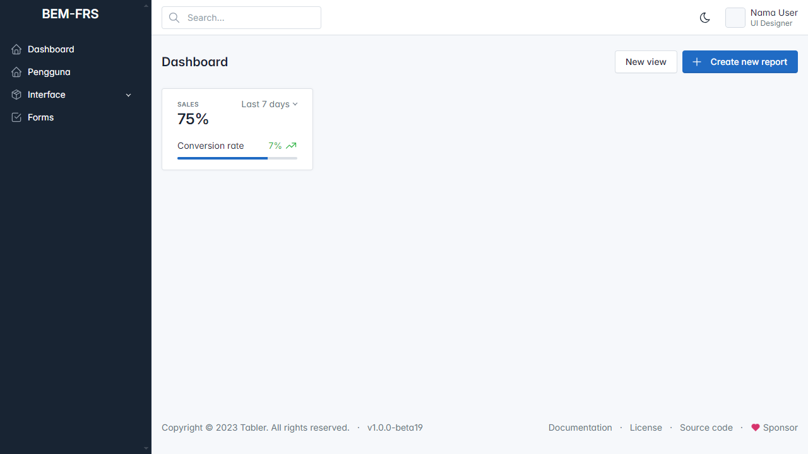
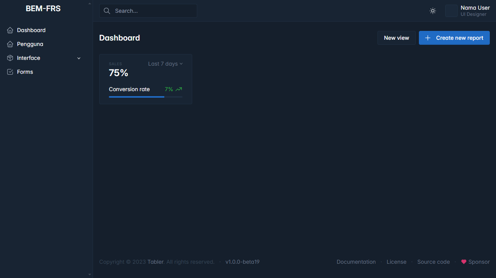

# Website BEM FRS

### Previews

Light Mode

Dark Mode

### Requirement
1. Web server (Apache, Nginx dll), Mysql. Pakai Xampp / Laragon udah sepaket
2. Composer
3. Nodejs
4. PHP version >= 8.2

### Cara Install ke Lokal Development
1. Clone Repo ini
2. Install dependency Laravel menggunakan composer :
   ``
   $ composer install
   ``
3. Karena menggunakan Breeze, install breeze dependency :
   ``
   $ php artisan breeze:install
   ``
4. Install dependency bagian assets :
   ``
   $ npm install
   ``
5. Jalankan NPM untuk assets nya:
   ``
   $ npm run dev
   ``
6. Jalankan server aplikasi :
   ``
   $ php artisan serve
   `` 
